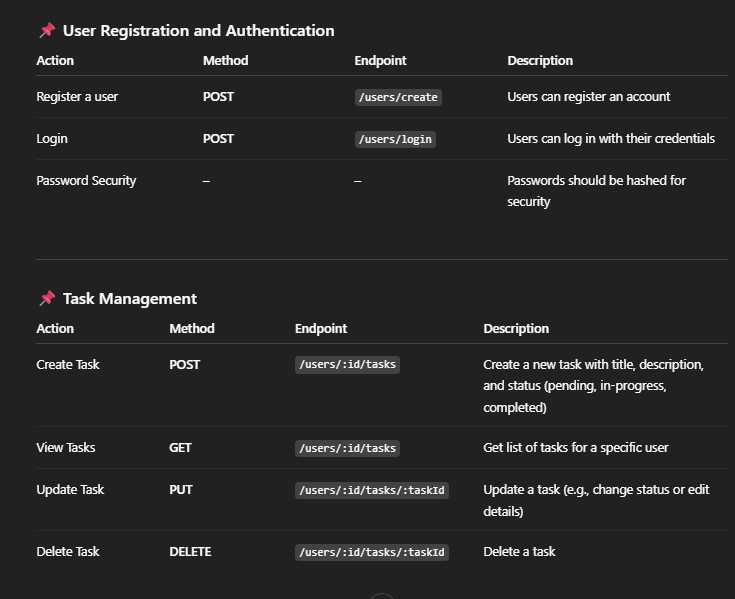
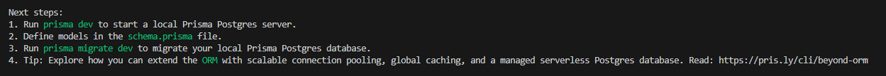

## Description

[Nest](https://github.com/nestjs/nest) framework TypeScript starter repository.

## Project setup

```bash
$ npm install
```

## Compile and run the project

```bash
# development
$ npm run start

# watch mode
$ npm run start:dev

# production mode
$ npm run start:prod
```

## Run tests

```bash
# unit tests
$ npm run test

# e2e tests
$ npm run test:e2e

# test coverage
$ npm run test:cov
```

## Deployment

When you're ready to deploy your NestJS application to production, there are some key steps you can take to ensure it runs as efficiently as possible. Check out the [deployment documentation](https://docs.nestjs.com/deployment) for more information.

If you are looking for a cloud-based platform to deploy your NestJS application, check out [Mau](https://mau.nestjs.com), our official platform for deploying NestJS applications on AWS. Mau makes deployment straightforward and fast, requiring just a few simple steps:

```bash
$ npm install -g @nestjs/mau
$ mau deploy
```

With Mau, you can deploy your application in just a few clicks, allowing you to focus on building features rather than managing infrastructure.

## Resources

Check out a few resources that may come in handy when working with NestJS:

- Visit the [NestJS Documentation](https://docs.nestjs.com) to learn more about the framework.


# Task management System

## Techstack

- Nestjs 
- Prisma ORM
- Postgres Database

## Application features

1. User registration and authentication
2. Task management




## Installations

1. npm install -g @nest/CLI
2. nest new project-name
3. installing prisma CLI locally - npm install prisma --save-dev
4. npx prisma init 
5. 
6. class validations - npm i --save class-validator class-transformer